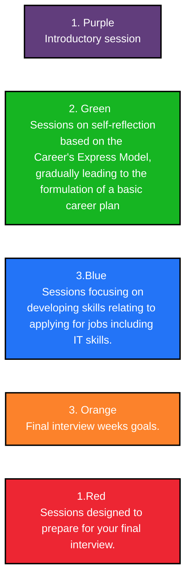

### PD1 Week1-Worksheet 
TASK 1:  
Use the ‘PD1 Week 1 –Module Information’ documenton the VLE to answer the questionsin groups.
1. What is the main focus of this course?
    - Potential career paths and development of students' **employability skills**
2. Who is the module leader for PD1? How can you contact them?
    - **Mod. Leader Kenneth Cohen** kenneth.cohen@london.aru.org 
3. What is the assessment method for this module? 
    - Interview
4. What are the key dates this term?

|Key | Dates |
|----------|---------------------| 
| Teaching | 9th to May 31 Jully |
|Examinations| 1st August to 5th August|
| (Re)sit Examinations| 9th December to 15th December.
5. Which week offers an opportunity to practice prior to your final interviews?
    - Week 10 **Preparing and Practicing Interviews**
6. What are the key sources being used on your course? 
    1.  Professional Development 1
    2.  The Career Zone website and other online materials 
7. What are the three main assessment offences? 
    1. Plagiarism
    2. Collusion
    3. Cheating
8. What should you do if you notice that the record of your attendance in the PD1 class isn’t right?
    - Contact the Attendance Team via attendance@london.aru.ac.uk 
9. What is the purpose of the course evaluation?
    - Obtain views to 
    - Continueally improve
    - reponding to issues 
      

---
TASK 2:  
Read the ‘PD1 Week 1 –Module Information’ document again then decide if the statements below are TRUE or FALSE
1. The course includes some sessions about using PowerPoint, Excel and Word documents.
    - False   
2. Weeks 6-8 of the course will focus mainly on CV writing and IT skills.
    - True
3. Your final assessment will be graded based on Task Fulfilment, Organisation, Use of Resources, and Professional Conduct.
    - True
4. You will need to pay close attention to activities marked by a blue folder during the course.
    - False its red
5. The final interview is worth 100% of the Professional Development Skills module.
    - True
---

TASK 3: 

Look at the Scheme of Work in the ‘PD1 Week 1 –Module Information’ document. Match the broad focus of each section of the trimester to its corresponding colour in the document:

---

Task 4: 
1. Open the ‘PD1 Week 1 –Graduate Career Guidebook p.22-23’ pdf document on the VLE and read about the Career Express Model which forms the first part of this course.
2. Hide the document. From memory, can you reorganise the stations below to place them in the order they appear in the model? 
3. Write the correct number of the station in the box.

    1. Station...
        -  Map out specifically what you need to do in order  to reach your career goal.
    2. Station...
        -  Link your abilities and interests to the positions  that you have identified  to pin point suitable positions.
    3. Station...
        -   Take your first steps to achieve your career goals.
    4. Station...
        -   Decide what it is that  you are looking for   professionally, and what skills and knowledge  you can provide to a potential employer.
    5. Station...
        -   Prepare yourself mentally for the journey ahead.
---

TASK 5:
- Look at the content of the interview in the ‘PD1 Week 1 –AssignmentBrief’and take a note of the words highlighted in orange.
- Cross checking with the Scheme of Workin the ‘PD1 Week 1 –Module Information’document,
what week of the trimester do you think you’ll be covering material useful for each topic?

Eg. One possible career path  >>> Week3

- Values:
- Current strengths:
- Current weaknesses:
- Employment history/educational background:
- Improvements
- Opportunities
- Digital identity and e-hireability

TASK 6: 
Look at the different topics covered each week for the Bronze Passport Scheme, and answer the questions below. 

1. When are the sessions run?
2. How long are the sessions?
3. What time are the evening sessions?
4. Which of these sessions would be most useful for you to attend in your
opinion?

